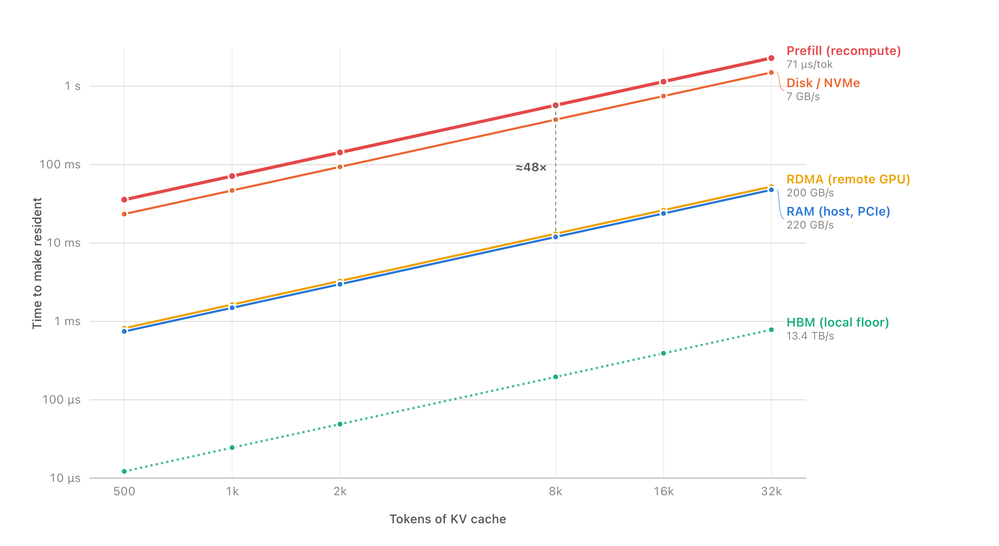
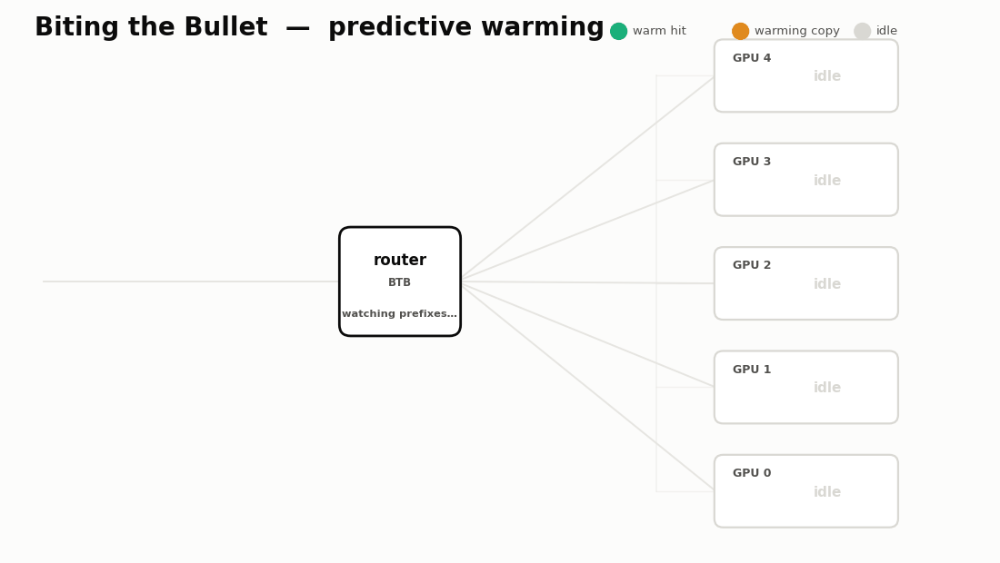
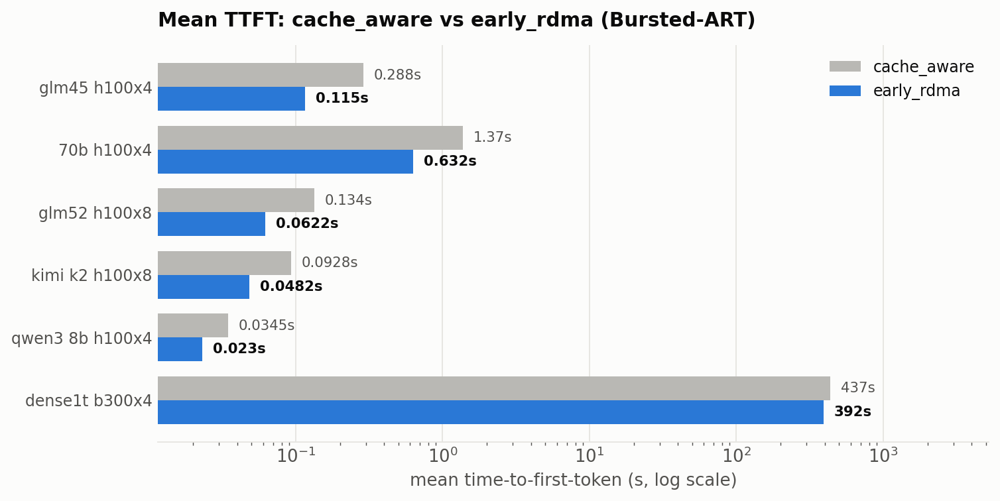

# Biting the bullet: Predictive speculative KV replication for bursty LLM inference

**TLDR:** When dealing with bursty LLM inference requests, you often get spikes of very similar prefix KV requests. We argue that 1\) this isn't represented in current datasets, and 2\) current GPU routing algorithms falter under this environment. We share Biting the Bullet “BTB”, which predicts large bursts and proactively replicates prefix cache from RDMA into GPU HBM before the burst lands. Across six model×hardware setups on our Bursted-ART trace, BTB cuts **mean time-to-first-token by 10–60%** (median ~51%) versus SGLang's default cache-aware router — and where the burst clears cleanly the p95 tail drops as much as **~80%** — while staying inert (within ±3%) on ordinary traffic.

# Background

We first need to understand how GPU routers work. When a service receives an LLM inference request, it typically first hits a router layer, such as Dynamo or SGLang model gateway. These routers will pick a GPU cluster to route your request to based on a policy you choose.

\<image that shows the requests, router, clusters\>

You next need to understand KV cache management. In LLM generation, every request is a sequence of tokens, and as long as two requests share the exact same prefix, they can reuse a lot of the already-computed math (the KV). It’s important to note that the prefix must match exactly, so even a single token different near the start of a request will break the KV cache.

\<Image that shows prefix\>

There are a few memory tiers for LLM inference. First is the GPU HBM. This is on each individual GPU and is the fastest and the smallest. Next is the CPU RAM shared by multiple GPUs that are all serving the same LLM. Above that is the disk or RDMA, which is shared amongst multiple clusters and is the slowest.

\<image that shows gpu tiers of memory\>

The numbers below are the real simulator constants for our standard node — **4× H100 tensor-parallel serving Llama-3.3-70B fp16** — with bandwidth aggregated across the 4 GPUs (the honest unit, since a KV load streams across all 4 at once).

| Tier | Per-GPU (datasheet) | **Per-node (×4)** | Role |
|------|--------------------:|------------------:|------|
| **HBM** | 3.35 TB/s | **13.4 TB/s** | local GPU memory (bandwidth floor / local hit) |
| **RAM (PCIe)** | 55 GB/s | **220 GB/s** | KV offloaded to host DRAM |
| **RDMA** | 50 GB/s (400G NIC) | **200 GB/s** | a peer node's KV over the fabric |
| **Disk / NVMe** | 7 GB/s | **7 GB/s** (shared) | local SSD prefix cache |
| **Prefill** | 989 TFLOP/s peak | **1.98 PFLOP/s eff** (MFU 0.5) | recompute |

At Llama-3.3-70B's shape the KV cache is **320 KiB/token** (`2 × 80 layers × 8 KV heads × 128 dim × 2 B`), and recomputing it (prefill) costs **71.4 µs/token**.

The cost of regenerating the KV depends on the length of the prefix that was matched. The longer the prefix, the bigger the cost of generating compared to replicating/moving from an already existing source like RAM (technically also the slightly bigger cost of moving more bytes, albeit not significantly bigger).

The reason is structural: **prefill is compute-bound while reuse is bandwidth-bound.** To get a prompt's KV resident you either recompute it (`2 × active_params` FLOPs per token) or stream the already-computed bytes from a memory tier (`bytes / bandwidth`). Both are linear in prompt length, so the prefill/transfer **ratio is constant** at any length — and that ratio is exactly the budget the bite-the-bullet warming policy spends when it fills a cheaper tier instead of prefilling again.

Time to make N tokens of KV resident (milliseconds), on the standard setup — **one node = 4×H100 tensor-parallel, serving Llama-3.3-70B fp16** (KV ≈ 320 KiB/token, MFU 0.5):

| Source | 500 | 1k | 2k | 8k | 16k | 32k | vs. prefill |
|--------|----:|---:|---:|---:|----:|----:|------------:|
| **Prefill (recompute)** | 35.7 | 71.4 | 142.8 | 571 | 1142 | 2284 | 1× |
| Disk / NVMe | 23.4 | 46.8 | 93.6 | 374 | 749 | 1498 | **1.5×** faster |
| RDMA (remote GPU) | 0.82 | 1.64 | 3.28 | 13.1 | 26.2 | 52.4 | **44×** faster |
| RAM (host, PCIe) | 0.75 | 1.49 | 2.98 | 11.9 | 23.8 | 47.7 | **48×** faster |
| HBM (local floor) | 0.012 | 0.024 | 0.049 | 0.20 | 0.39 | 0.78 | **2919×** faster |

Clearly, prefill again is much more expensive than keeping KV cache ready using the cache. Concretely:

- Anywhere KV already exists in HBM / RAM / RDMA, moving it costs **1–2 orders of magnitude less** than the FLOPs to regenerate it (≈48× vs RAM, ≈44× vs RDMA).
- A **local HBM prefix hit is essentially free** relative to prefill (~2900×).
- **Disk is the exception:** NVMe (7 GB/s, unaggregated) is only **~1.5×** faster than recomputing — which is why pulling KV off local SSD barely beats prefill.

This is the whole economic case for warming: if you can see a burst coming, replicating its prefix into HBM/RDMA ahead of time is ~44–48× cheaper than letting each replica prefill it from scratch.

# Large, batched requests break routers

There are a few routing policies that these routers such as Dynamo and SGLang Model Gateway provide out of the box, the most popular by far being Cache Aware. But each has their own trade-offs that I'll highlight below.

**Least Load**
The router selects the GPU with the lowest load.

While this has the lowest queue time, it has by far the most prefill time. Each cold node it lands on doesn't hold the shared prefix, so it recomputes the whole thing from scratch — the ~44× more expensive path from the cost chart above, paid once per node the burst touches.

*Best case* — a stream of unrelated requests gets spread evenly, no node hot-spots, and there was little prefix to reuse anyway.
\<image gif that shows least load routed to\>

*Worst case* — a burst of same-prefix requests gets scattered across cold nodes, so almost none of them hit cached KV and every node pays the full prefill.
\<image gif that shows least load routed to worst case\>

**Cache Aware**
The router sends each request to the node with the best KV-cache affinity, falling back to load balancing once that node gets too loaded (a hot-node overflow threshold). This gives the fastest prefill time because most requests hit warm KV.

*Best case* — a steady trickle of similar-prefix requests, each reusing the KV the last one left warm on the same node.
*Worst case* — a burst of same-prefix requests: affinity funnels the *entire* burst onto the single node that holds the prefix, where they queue behind each other while the rest of the cluster sits idle.

We believe that fundamentally these have not been covered by routers because current datasets of LLM request streams do not fully cover the bursty, deep-shared-prefix regime.

# Workload: does this pattern even exist in public traces?

Before designing a policy for synchronized long-prefix fan-out, we asked whether that pattern even shows up in the traces people benchmark on. The **target** is a *deep-sync fan-out*: ≥ 20 requests sharing a ≥ 16-block (~8k-token) prefix, all arriving within ≤ 10 s — a data-labeling sweep or sub-agent fan-out, not a shared system-prompt template. To exist at all it needs two things a trace can be missing: per-request **arrival timestamps** (or a burst can't be expressed) and **prefix/content** (or same-prefix fan-out can't be measured).

| Trace | Rows read | Arrival timestamps | Prefix / content | **Deep-sync fan-out** (≥16 blk, ≤10 s) | Target present? |
| --- | ---: | :---: | :---: | ---: | :--- |
| ART-Chat-2.5M | 300,000 | ✅ | ✅ | **25** | ⚠️ marginal — only 3 events in 300k (~0.1/hr) |
| Mooncake (conv / tool-agent / arxiv) | 12k–24k | ✅ | ✅ | **2** | ❌ big numbers are shallow shared templates |
| BurstGPT | 300,000 | ✅ | ❌ | — | ❌ no prefix → can't be measured |
| LMSYS-Chat-1M | 1M convs | ❌ | ✅ | — | ❌ no timestamps → can't exist |
| ShareGPT | ~90k convs | ❌ | ✅ | — | ❌ no timestamps → can't exist |

The pattern is **absent from every public trace**: the chat dumps can't even express it, BurstGPT can't measure it, Mooncake's big fan-outs are shallow boilerplate headers (they collapse from ~200-way to single digits the moment you require a long shared prefix), and the one trace that shows it at all — ART — shows a 25-way burst three times in 300k requests, an order of magnitude below the hundreds-to-thousands of a real production sweep. So we build it.

## Bursted-ART

So we created our own dataset, **Bursted-ART**: real ART replay windows plus synthetic same-prefix bursts, keeping ordinary ART traffic in the same corpus. Each synthetic burst models a data-labeling / batch / sub-agent fan-out job:

- **8** burst jobs per synthetic window, each **500 requests** sharing a **65,536-token** prefix (256 unique suffix tokens per request, 1 output token).
- **120** one/few-request decoy jobs per synthetic window (so a detector can't just fire on any repeat).
- each burst's 500 requests arrive over a **60-second window** — the sustained-reuse regime where predictive KV warming has time to repay the copy.

Splits are by complete trace window (not by row, to avoid neighboring-request leakage): **train** 25,600 rows / 10 windows, **test** 76,800 rows / 30 windows.

Here is the link to it: [https://huggingface.co/datasets/shreybirmiwal/Bursted-ART](https://huggingface.co/datasets/shreybirmiwal/Bursted-ART)

# Biting the bullet

What if we could detect a sustained reuse of a prefix, then copy that over onto multiple GPUs from the RDMA onto the HBM before more requests arrive later? That's the whole idea. `least_load` scatters the burst onto cold nodes that each recompute; `cache_aware` piles it onto the single node that holds the prefix. BTB (which we run as the `early_rdma` policy) instead **warms M copies and spreads the burst across them.**

## The algorithm (four constants)

> If the same **Y**-block prefix arrives **X** times within **Z** seconds, replicate its KV to the **M** least-busy replicas, then route later same-prefix requests to a warm copy.

| Constant | Meaning | Value |
|----------|---------|-------|
| **X** | repeats needed to fire | 2 |
| **Y** | shared-prefix length — matched on **and** copied | 256 blocks (the 65,536-tok burst prefix) |
| **Z** | detection window (seconds) | 1 |
| **M** | **replicas (nodes)** to warm | 4 |

**M is replicas, not GPUs.** A replica is `n_gpus` GPUs serving tensor-parallel — weights and KV are *sharded* across them, so one node holds one sharded copy of the prefix KV. M=4 replicates that copy onto 4 separate nodes. A prefix a node does not hold is recomputed, so putting the KV on a replica *before* its first same-prefix request lands saves that recompute.

## Experiments

We replay **Bursted-ART** — the full test set, real ART traffic plus synchronized bursts — as a real trace (window by window) through the inference simulator, across six model×hardware setups, and pool TTFT over all requests. Baseline is `cache_aware`, SGLang's default router, with no warming.

## Results

| setup | CA mean | CA p95 | BTB mean | BTB p95 | mean speedup | p95 speedup |
|---|--:|--:|--:|--:|--:|--:|
| 70b_h100x4 | 1.373s | 4.697s | 0.632s | 4.697s | **+54.0%** | +0.0% |
| qwen3_8b_h100x4 | 0.034s | 0.325s | 0.023s | 0.059s | **+33.3%** | +81.8% |
| glm45_h100x4 | 0.288s | 1.905s | 0.115s | 0.780s | **+60.0%** | +59.0% |
| glm52_h100x8 | 0.134s | 1.101s | 0.062s | 0.243s | **+53.5%** | +78.0% |
| kimi_k2_h100x8 | 0.093s | 0.832s | 0.048s | 0.167s | **+48.1%** | +79.9% |
| dense1t_b300x4 | 436.8s | 926.1s | 392.0s | 857.9s | **+10.3%** | +7.4% |

BTB cuts **mean TTFT by 10–60%** (median ~51%), and on the H100 setups the p95 tail improves even more (+78–82% for qwen3-8b, glm52, kimi-k2) because warming clears the queue that cache-aware builds when the whole burst piles onto one node.

The table is about **TTFT, not steady-state decode TPS**. BTB does not make the model decode tokens faster; it gets repeated-prefix requests into decode sooner by avoiding shared-prefix recompute and the hot-node queue that recompute creates.

The 70b setup is the interesting edge: mean drops 54% but p95 is flat. That's not a bug — the p95 request is the *very first* request of a burst, which has to eat a full cold prefill of the 65,536-token shared prefix before any warm copy can exist: `65,536 × 71.4 µs ≈ 4.68 s`, essentially the entire 4.70 s p95. BTB can't warm a prefix it hasn't seen yet, so it only helps the requests that follow — which is exactly why the *mean* still drops 54%.

The dense1t/B300 row looks backward only if you read "bigger model" as a single scalar. The pure economics are actually strongest there: the 65,536-token shared-prefix recompute is ~29.1 s, while the RDMA copy is ~40 ms. But the reported speedup is end-to-end TTFT over full mixed windows. Every synthetic request still has a unique 256-token suffix, which costs ~114 ms to prefill on the dense 1T model, and the huge model leaves tight KV headroom, so bursts build a large queue even after the shared prefix is warm. Warming removes the repeated shared-prefix miss, but it cannot remove unavoidable per-request suffix prefill or decode pressure, so the percentage win is smaller (but still real) at 10%.

# Future ideas

- **Speculative prefill** — start prefilling a predicted burst prefix even before the copy lands.
- **50% fake prefill** — warm partially and pay down the rest lazily.
- **More cache actions** — pin / evict / demote across tiers, not just replicate.
- **Try on real production** traffic rather than a synthesized trace.
- **Adaptive detection** — we prototyped an adaptive predictor that tunes X/Y/Z/M online. It worked and hit ~15%, but was too complex, so we shipped the simple fixed-constant approach first.
